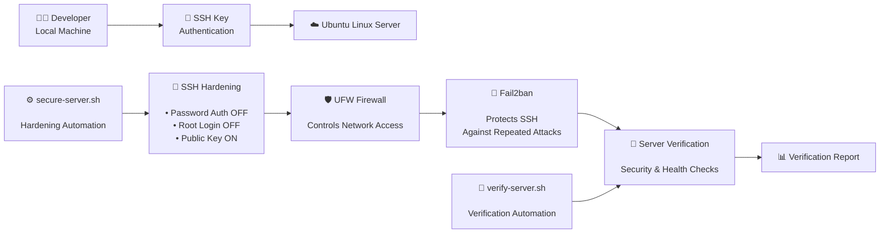
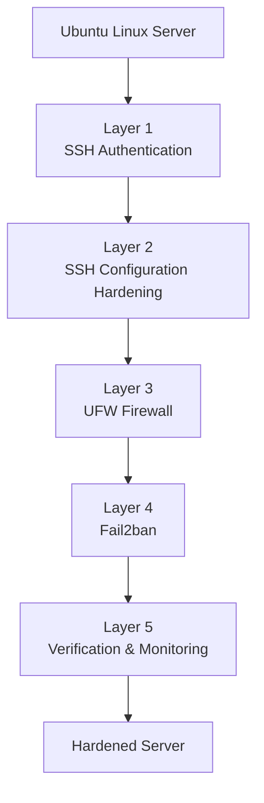
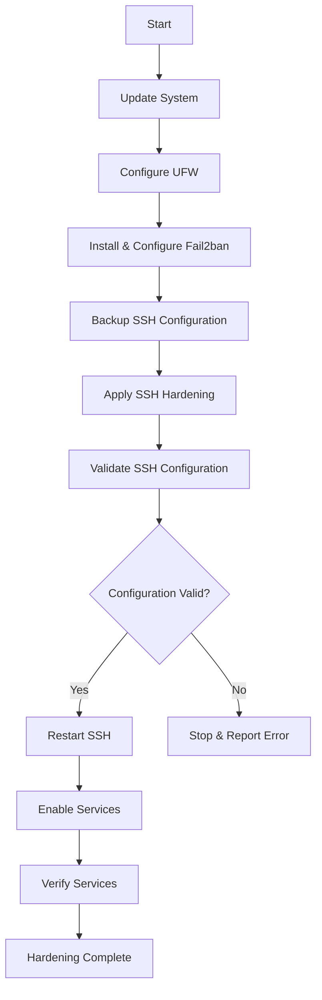
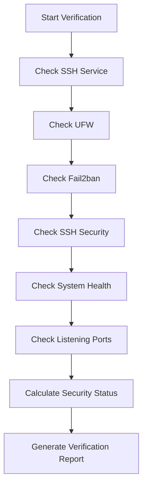

# Linux Server Hardening — Architecture

> High-level architecture of the Linux server hardening and verification workflow.

---

## System Architecture



---

## Security Flow

The server follows a layered security model:



---

## Automation Workflow

The hardening process is automated through `secure-server.sh`.



---

## Verification Workflow

The `verify-server.sh` script audits the final server state.



---

## Security Controls

| Component | Responsibility |
|---|---|
| SSH Keys | Secure remote authentication |
| SSH Hardening | Restricts insecure SSH access |
| UFW | Controls inbound network traffic |
| Fail2ban | Mitigates repeated authentication attempts |
| `secure-server.sh` | Automates hardening |
| `verify-server.sh` | Audits the final server state |

---

## Operational Flow

```text
Connect
   ↓
Assess
   ↓
Backup
   ↓
Harden
   ↓
Validate
   ↓
Restart
   ↓
Test
   ↓
Verify
   ↓
Report
```

---

## Design Principle

The project follows a simple DevOps security principle:

> **Automate the configuration, validate the changes, and verify the resulting state.**
